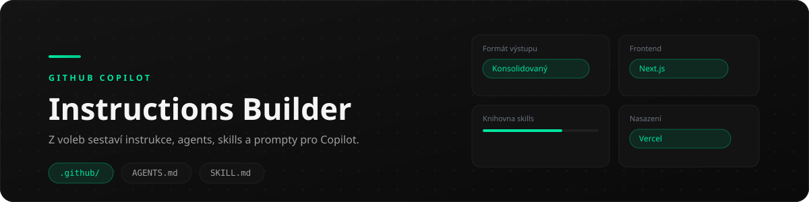
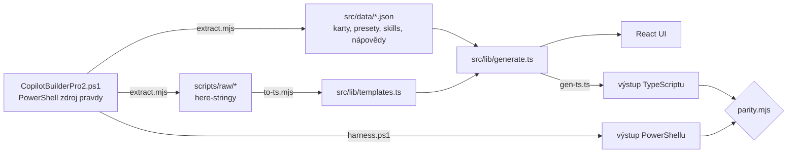

<p align="center">
  
</p>

<p align="center">
  
  
  
  
  
  
  
</p>

<p align="center">
  Naklikáte doménu, technologie a moduly. Dostanete hotovou konfiguraci pro GitHub Copilot.
</p>

---

## O čem to vlastně je

Copilot Instructions Builder je webový průvodce, který z vašich voleb sestaví sadu souborů pro GitHub Copilot. Provede vás projektem od domény (e-shop, SaaS, LMS) přes technologický stack až po jednotlivé moduly. Copilot pak z těch souborů čte kontext, takže píše kód podle vašich konvencí místo toho, aby si vymýšlel vlastní.

Původně to byl PowerShell skript s oknem ve WinForms. Tahle verze je jeho přepis do Reactu a TypeScriptu, přičemž výstup musí zůstat shodný do posledního bajtu.

> [!TIP]
> Chcete vygenerovat konfiguraci hned? Otevřete aplikaci, projděte pět kroků průvodce a klikněte na **Vygenerovat soubory**. Všechno běží v prohlížeči, nikam se nic neposílá.

## Proč to existuje

Ruční psaní instrukcí pro Copilot je otrava. Člověk obvykle skončí u tří odstavců, zapomene na konvence projektu a po měsíci neví, proč tam ta pravidla jsou. Tenhle nástroj z toho udělá něco, co se dá naklikat a co jde rozumně udržovat:

- **Konzistentní kontext.** Stejná struktura instrukcí pro každý projekt, ať ho začínáte znovu nebo přebíráte.
- **Doménové know-how.** Presety pro e-shop, rezervační systém, SaaS, LMS nebo CRM vědí o typických nástrahách oboru.
- **Bez vendor lock-inu.** Vygenerované soubory jsou obyčejný markdown a YAML, které si můžete přepsat.

## Co vygenerujete

| Soubor | K čemu slouží |
| --- | --- |
| `.github/copilot-instructions.md` | Hlavní kontext, který Copilot načítá vždy. Architektura, stack, pravidla a skills. |
| `AGENTS.md` | Stejná pravidla pro ostatní AI agenty a nástroje. |
| `.github/workflows/copilot-setup-steps.yml` | Prostředí pro coding agenta, tedy Node, pnpm a databáze. |
| `.github/skills/SKILL.md` | Podrobné postupy a kontrolní seznamy. Jen v rozšířeném formátu. |
| `.github/agents/agent-task.agent.md` | Definice agenta pro plnění úloh. Jen v rozšířeném formátu. |
| `.github/prompts/<slug>.prompt.md` | Úkolový prompt ke vložení do chatu. Volitelně. |
| `PROJECT_PLAN.md` | Rozdělení práce do fází. Volitelně. |
| `project.config.json` | Strojově čitelný souhrn voleb. |
| `README.md` | Startovní README pro váš projekt. |
| `.env.example` | Přehled proměnných prostředí bez hodnot. |
| `.agentic/manifest.json` | Kontext pro agentní nástroje. Volitelně. |
| `CONTRIBUTING.md` | Postup pro přispěvatele. Volitelně. |

## Tři formáty výstupu

Formát se volí v kartě **Formát výstupu** na záložce Skills.

| Formát | Co obsahuje | Kdy se hodí |
| --- | --- | --- |
| **Konsolidovaný** | Instrukce, agent, setup a základní projektové soubory. | Chcete jeden velký kontext a nic víc. Výchozí volba. |
| **Rozšířený** | Navíc `SKILL.md` a definice agenta pro úlohy. | Máte větší projekt a chcete skills rozdělené do souborů. |
| **Jen instrukce** | Pouze to, co Copilot opravdu načítá. | Nechcete do repozitáře nic navíc. |

> [!NOTE]
> Přesný seznam souborů pro vaše volby vidíte v aplikaci na záložce **Projekt**. Shodu tohoto seznamu se skutečným výstupem generátoru hlídá test.

## Jak se to ovládá

Aplikace má tři vrstvy, mezi kterými se dá volně přeskakovat:

1. **Průvodce na záložce Presety.** Pět kroků, kde nastavíte název projektu, doménu, cílovou platformu, framework a volnou specifikaci. Dole jsou rychlé šablony pro doménu, framework, mobil a cílové platformy.
2. **Detailní záložky.** Architektura, Frontend, Backend, DevOps, Bezpečnost, Funkce, Moduly, Mobil a Chování. Každá obsahuje karty s volbami, které se propisují do výstupu.
3. **Skills a výstup.** Na záložce Skills vyberete postupy, které se vloží do instrukcí. Tlačítkem **Vygenerovat soubory** vznikne náhled, odkud je zkopírujete nebo stáhnete.

Doplňky, které se hodí znát:

- Volby se ukládají do `localStorage`, takže obnovení stránky nic neztratí. Tlačítko **Reset** vrátí výchozí stav.
- Vyhledávací pole v hlavičce záložky hledá v názvech voleb i v textu nápovědy.
- Najeďte na volbu a uvidíte vysvětlení. Celý slovník je na záložce **Slovník**.
- Konfiguraci lze uložit do `builder-config.json` a později načíst, takže se dá sdílet nebo verzovat.
- V okně s výstupem zavře `Esc`, obsah jde kopírovat nebo uložit hromadně.

## Spuštění lokálně

Potřebujete Node.js 20 nebo novější a pnpm.

```bash
git clone https://github.com/Crazyka51/Copilot-instructions-builder.git
cd Copilot-instructions-builder
pnpm install
pnpm dev
```

Aplikace poběží na `http://localhost:3000`. Port je pevně daný ve `vite.config.ts`, takže se nevybere náhodný jiný.

```bash
pnpm build     # produkční build do dist/
pnpm preview   # náhled produkčního buildu
```

Build je statický, takže `dist/` nasadíte na GitHub Pages, Netlify nebo Vercel bez konfigurace serveru.

## Jak je to postavené



Aplikace **neobsahuje ručně psané šablony**. Všechny texty, karty, presety, skilly a nápovědy se odvozují z PowerShell skriptu. Když se změní on, spustíte `pnpm run extract` a data se přegenerují.

| Krok | Soubor | Co dělá |
| --- | --- | --- |
| 1 | `scripts/extract.mjs` | Parser PowerShellu. Vytáhne karty, presety, katalog skills, nápovědy a šablony. |
| 2 | `scripts/to-ts.mjs` | Převede here-stringy na TS šablonové funkce včetně interpolací a podmínek. |
| 3 | `src/lib/generate.ts` | Generátor. Zrcadlí funkce `Get-*` z PowerShellu. |
| 4 | `scripts/harness.ps1` | Spustí původní skript bez GUI a bez dialogů. |
| 5 | `scripts/parity.mjs` | Porovná oba výstupy soubor po souboru. |

> [!IMPORTANT]
> Soubory `src/lib/templates.ts` a vše v `src/data/` jsou **generované**. Ruční úpravy přepíše příkaz `pnpm run extract`.

## Kontrola kvality

```bash
pnpm typecheck   # tsc --noEmit
pnpm lint        # ESLint, flat config
pnpm test        # 26 testů přes node:test a tsx
pnpm smoke       # 28 presetů krát 3 formáty
pnpm parity      # srovnání s PowerShell verzí
```

Aktuální stav:

| Kontrola | Výsledek |
| --- | --- |
| Typová kontrola | 0 chyb |
| Lint | 0 problémů |
| Testy | 26 z 26 |
| Smoke test | prochází |
| Parita | 25 z 25 souborů |

Testy pokrývají stav voleb a presety, konfiguraci a její načtení, generátor včetně markerů a validity JSON, a také integritu dat. Ta poslední skupina odhalí třeba to, že preset odkazuje na volbu, která už v datech není.

## Ruční záplaty

Něco ve zdrojovém PowerShellu chybí nebo je nekonzistentní. Takové opravy patří do `scripts/patches.json`, protože je `extract.mjs` aplikuje na konci a přežijí regeneraci dat:

- `helpAliases` pro klíč nápovědy, který se ve skriptu liší jen velikostí písmen.
- `helpExtra` pro úplně chybějící text nápovědy.

Díky tomu se oprava neztratí při dalším `pnpm run extract`, což je u generovaných dat jinak běžný problém.

## Struktura projektu

<details>
<summary>Rozbalit strom souborů</summary>

```
src/
  App.tsx                 orchestrace stavu a rozvržení
  main.tsx                vstupní bod
  styles.css              emerald dark theme
  components/
    TopBar.tsx            název projektu, stav a hlavní akce
    Sidebar.tsx           záložky ve skupinách a ukazatel průběhu
    TabHeader.tsx         název záložky, filtr a hromadné akce
    CardGrid.tsx          mřížka karet jedné záložky
    CardView.tsx          jedna karta voleb
    PresetsTab.tsx        průvodce a rychlé šablony
    SkillsTab.tsx         volby skillů a knihovna podle kategorií
    ProjectTab.tsx        přehled generovaných souborů
    DictionaryTab.tsx     slovník nápovědy
    OutputModal.tsx       náhled a uložení výstupu
    FooterBar.tsx         souhrn a hlavní akce
  lib/
    templates.ts          GENEROVÁNO, needitujte ručně
    generate.ts           generátor
    state.ts              výběr, presety, konfigurace
    help.ts               nápověda voleb
    filter.ts             filtrování karet a voleb
    ui.ts                 záložky, kroky průvodce, seznam souborů
    download.ts           stahování souborů
    usePersistentState.ts stav v localStorage
    types.ts              sdílené typy
    *.test.ts             testy
  data/                   GENEROVÁNO z PowerShellu
scripts/
  extract.mjs             extrakce dat ze skriptu
  to-ts.mjs               převod šablon do TypeScriptu
  gen-ts.ts               spuštění TS generátoru
  harness.ps1             běh původního skriptu bez GUI
  parity.mjs              paritní test
  smoke.ts                smoke test
  resolve-ps1.mjs         hledání zdrojového skriptu
  vendor-ps1.mjs          vendorování skriptu
  patches.json            ruční záplaty
docs/
  banner.svg              banner pro README
```

</details>

## Poznámky pro vývojáře

- Zdroj pravdy pro závislosti je `pnpm-lock.yaml`. Soubor `package-lock.json` je pozůstatek z npm a můžete ho smazat.
- Konfigurace pnpm je v `pnpm-workspace.yaml`. Od pnpm 10 se pole `pnpm` v `package.json` ignoruje, proto je povolení build skriptu pro `esbuild` tam.
- Karty na záložce Skills mají konfigurační klíč ve tvaru `Skills|<název>`, stejně jako kategorie skills. Načítání konfigurace proto nejdřív zkouší kartu a teprve pak kategorii.
- Presety **neobsahují** radio karty domény, frameworku, mobilu a cíle. Hodnotu těchto karet zapisuje funkce `applyPresetWithTrigger`, jinak by ji průvodce nikdy neuložil.
- Funkce `polish()` převádí `Nespecifikováno` na `neuvedeno`. Na JSON konfiguraci se záměrně neaplikuje, aby zůstala shoda s PowerShell verzí.
- Animace respektují `prefers-reduced-motion`.

## Časté otázky


**Posílá se něco na server?**
Ne. Všechno se počítá v prohlížeči, včetně generování souborů. Volby zůstávají ve vašem `localStorage`.

**Funguje to offline?**
Po `pnpm build` ano. Výsledek je statický web bez backendu.

**Můžu si vygenerované soubory přepsat?**
Ano a klidně je to i žádoucí. Slouží jako startovní bod, ne jako něco, co se nesmí měnit.

**Proč je výstup shodný s PowerShell verzí?**
Protože původní skript se pořád používá a nechceme, aby se obě verze rozešly. Paritní test je pojistka, že se tak nestane.

## Licence

[MIT](LICENSE). Projekt můžete používat, upravovat, šířit i prodávat. Stačí zachovat uvedení autora a text licence.
